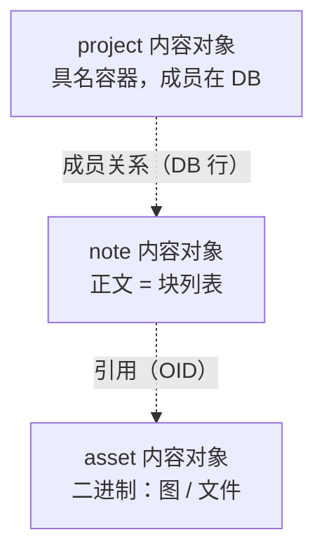
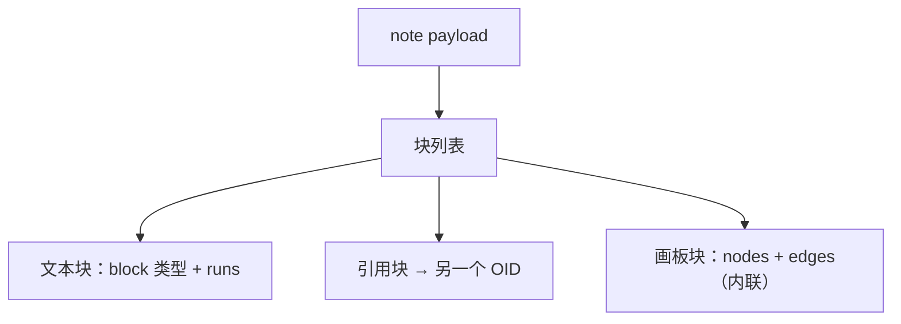

<!-- SPDX-FileCopyrightText: 2026 HanYang06 -->
<!-- SPDX-License-Identifier: Apache-2.0 -->

# 数据结构（对象模型 · 内存态 / 存储态）

> 定位：Cairn 的**对象模型总纲**——逻辑模型 + 存储态 + 内存态。
> 关系：[`storage.md`](./storage.md) 是 **L0 物理层的唯一事实来源**，本文引用它、不重复它；
> 语义与领域规则见 [`domains.md`](./domains.md)、[`note-model.md`](./note-model.md)。
> 一句话：**Cairn = 含义堆（meaning heap）**——底座只加能力、不改结构，语义往上堆。

状态：**草案 v0.3**（行序列 + 行内区间样式、关系进 DB、通用版本引擎**已实现**；
本文其余「Manifest / 加密 / structure.db」等段落仍待按桶块模型整体重写，见 §13 与 `progress.md`）

---

## 0. 一页看懂（对象拓扑）

> 目的：让新协作者**不翻代码**就能建立整体图景。

### 0.1 两条铁律

1. **嵌套止步于对象边界。**
   对象**内部**可以嵌套（正文的块、块内的 runs、画板的节点+边）——因为总是整块读、整块写；
   对象**之间**必须平——按 ID 引用，**绝不按值包含**。
2. **按性质分家。**
   **内容**（字节）进对象池：加密 / 去重 / 分块 / 传输；
   **结构**（关系 / 成员 / 标签 / 属性）进数据库：索引 / 约束 / join。

> 这两条是本项目数据结构的**总开关**：对象少了、查询快了、存储不再因嵌套而放大。

### 0.2 内容对象（世界只有三个）



- `note`：正文 = 有序块列表（可内联画板）。
- `asset`：二进制内容（图片、任意文件），只被引用、永不嵌套——这就是"物理内容对象"。
- `project`：具名容器。**成员不是塞进结构，而是 DB 里的关系行**。
- 画板默认**内联在 note 里**；只有需要跨笔记共享时才升格为独立对象（见 §5.3）。

### 0.3 对象内部（这里才允许嵌套）



### 0.4 边只有两类（对象之间）

| 名称 | 含义 | 存哪 |
|---|---|---|
| **引用 reference** | 片段 → 另一个对象（OID），**不复制内容** | 对象 payload 里的引用块 |
| **关系 relation** | 对象 ⇄ 对象，有向、带署名 | **数据库表**（不是对象） |

> 曾经的第三种边"**包含 containment**"不再是对象间关系——它**降级为对象内部的列表顺序**（块序列、画板节点）。
> **嵌套只活在对象里面**，所以三边变两：引用靠 OID，关系进 DB。

### 0.5 阅读路径

1. 本文：§2 词表 → §4 逻辑模型 → §5 对象内部 → §6 存储态 → §7 内存态。
2. 物理细节 → [`storage.md`](./storage.md)。
3. 领域语义 → [`domains.md`](./domains.md)、[`note-model.md`](./note-model.md)。
4. 代码入口 → 本文 §12 映射表。

---

## 1. 为什么单列一文

- Cairn 会**不停往上堆**（今天是笔记/项目，明天可能是别的东西）。**底层数据结构会持续扩张**，这是最大的风险。
- 不把结构**提前定死并写清楚**，将来重构会失控——所以本文的作用是**约束**：什么可以加、怎么加、什么绝不能动。
- 判据（任何设计变更都要过这三关，缺一不可）：

| 判据 | 含义 |
|---|---|
| **性能** | 读快、写快；加载与保存在最坏情况下也要可接受 |
| **存储利用率** | 不为结构本身浪费大量空间（"占 40G、有效 20G"不可接受） |
| **综合** | 并发性、安全性、可加密性、扩展性 |

---

## 2. 词表（先统一语言）

| 词 | 英文 | 含义 |
|---|---|---|
| 内容对象 | Content object | 有 OID、进对象池的东西，目前只有 `note` / `asset` / `project` |
| 结构数据 | Structure data | 关系 / 成员 / 标签 / 属性，落 **DB 表**，不是对象 |
| 平行分布存储 | flat storage | 对象之间只按 ID 引用、不嵌套；"对象丢哪儿都行" |
| OID | — | **稳定**、作者绑定的对象标识（ULID）。**身份 ≠ 内容** |
| CID | — | **内容寻址**（keyed BLAKE3）。用于块与不可变叶的寻址/去重 |
| 块 | Block | 正文列表里的一个元素：文本块 / 引用块 / 画板块 |
| run | — | 文本块内部的一段**同格式文字**（加粗、链接等） |
| 画板 | Canvas | 一个可内联的图：逻辑图（diagram）或自由手绘（sketch） |
| 节点 / 边 | Node / Edge | 逻辑图内部元素：节点是形状，边是连接（**都在画板内部**） |
| 图元 | Shape | 画板里的基础几何：`ellipse` / `rect` / `polygon` |
| 文档头 | Head | 当前版本的 `Manifest` |
| 存储块 | Chunk | FastCDC 切出的字节块，用于去重 / 加密 / 随机读 |

> **两个"块"别混**：`Block`（正文里的块元素）与 `Chunk`（物理存储块）。二者正交。

---

## 3. 分层

```
L3  领域（角色 + 规则）    note / project / asset / relation
        │  只依赖 ↓ 的公共 API
L0.5 基板层（公共底座）     块列表编解码 + runs 规范化 + 画板结构
        │
L0  对象池（Qt-free）       对象/清单/块/加密/索引/版本
        │
物理层                      对象池文件（见 storage.md）
                            结构库 structure.db（权威）+ index.db（派生）
```

**红线**：`L0 / L0.5` 不认识 `note / issue` 这些词；角色只活在 `L3`。

---

## 4. 逻辑对象模型

### 4.1 平坦的对象图

对象之间**没有树**：只有一批平铺的对象，彼此通过 **OID 引用** 或 **DB 关系行** 相连。

```
note ──ref──► asset            （引用：payload 里的引用块）
note ──relation(DB)──► project （关系：DB 行）
```

- **没有递归嵌套**：不会出现"对象里装对象、对象再装对象"。
- 需要"包含"时，一律改成引用或关系，由 DB 表达成员/层级。

### 4.2 内容 vs 结构（"按性质分家"落地）

| | 内容 | 结构 |
|---|---|---|
| 是什么 | 字节流：正文、图片、文件 | 关系、成员、标签、`props` |
| 载体 | 对象池（一对象一 manifest + 分块） | `structure.db` 表 |
| 为什么 | 加密 / 去重 / 分块 / P2P 传输 | 索引 / 约束 / join / 事务 |
| 查询 | 靠 `index.db`（可重建） | 直接查表（权威，**不可重建**） |
| 例 | `note` / `asset` | `relation` / 项目成员 / `obj_tags` / `props` |

### 4.3 type → format 映射（一张表，禁止造第二套类型系统）

| type | format | 说明 |
|---|---|---|
| `cairn.note` | substrate | 笔记：正文 = 块列表 |
| `cairn.asset` | asset | 二进制 / 大对象 |
| `cairn.project` | substrate | 内容对象（payload 通常为空）；成员走 DB 关系 |
| `cairn.relation` | —（不是对象） | 一条 DB 行：`src / dst / kind / author / at` |

> `composition`（文档 / 博客）**不再单列格式**：它就是"正文里放一堆引用块"的 note，属于角色差异而非新物种。

### 4.4 扩展方式（"含义堆"怎么堆）

- 加**角色**：加一个 `type` + 映射表一行 + UI 壳。**不碰 Manifest**。
- 加**字段**：走 `meta.props`（见 [`domains.md`](./domains.md)）。**不碰 Manifest**。
- 加**关系**：加一个 `kind`（DB 行）。不碰底座。
- 加**块类型 / run 样式**：加一个 `block` 值或 run 属性（`data-model.md` §5）。不碰底座。
- 加**图形**：加一个 `form` 或参数（§5.4）。不碰底座。
- 只有**新的物理能力**（如新的加密原语）才动 L0，且必须过 §1 三判据。

---

## 5. 对象内部结构（允许嵌套）

### 5.1 正文 = 有序行序列 + 行内区间样式

> **已实现（M0，2026-09-17）**：`note/model.py` / `note/edit.py`。旧稿的"块 + runs"已收敛如下。

```
body  = [ {"id": 行id, "v": "一行文字"}, {"id": 行id, "v": {"canvas": n}}, ... ]
style = { 行id: [ {区间(tuple): Style} ] }
```

- **一元素 = 一行 / 一块**：顺序即位置；行序列用 list 保序（canonical CBOR 排序 map key，dict 不能保序）。
- **行 id 稳定**（ULID，生成即锁死）：行增删 / 重排不影响样式与版本（无下标漂移）。
- **样式是叠加层**：`{行id → 区间层}`；行内加粗只需加区间，不拆 body；后层压前层；规范化为不重叠、有序、去默认。
- **取消独立 runs 字段**：行内样式由区间表达；旧"样式等长平行 list"已废弃。
- **内容签名（cID）剥离行 id**：同文同样式 → 同签名 → 可去重；改一字即不同。
- **长行**不设内核上限，交给 UI（超阈值关自动换行、逼硬回车）。

> §5.2 的引用块统一为占位元素；§5.3 画板、§5.5 手绘仍为草案（数据模型在，无编辑 UI）。

### 5.2 引用块 = 一切"多媒体"的统一形态

- 图、视频、文件、别的笔记 → 一律是 `{"kind":"ref","oid":...}`，二进制本体另存为对象。
- 引用**不复制内容**，随被引用对象自身的版本走。
- 行内引用（文字里点一下跳过去）用 run 的 `link` 表达，同样是 OID。

### 5.3 画板（Canvas）

画板是一个**可内联的图**，两种模式共用一套壳：

```
canvas = {
  "mode": "diagram" | "sketch",

  # diagram 模式：真相 = 语义
  "nodes": [ {"id": "n1", "form": "rect", "params": {...},
              "text": "…", "pos": [x, y], "rot": 0} ],
  "edges": [ {"from": "n1", "to": "n2", "label": "是"} ],

  # sketch 模式：真相 = 笔画
  "strokes": [ {"points": [[x, y], ...], "style": {...}} ]
}
```

**diagram（逻辑图优先）**

- 用户只表达**语义**：谁和谁连（nodes + edges），以及每个节点的形状与文字。
- **布局与连线是派生的**：由布局器（分层：上下 / 左右）与连线器自动计算。
- 允许把某些节点**钉住 / 冻结**（存 `pos` / `rot`），其余自动——"想摆好看时能救，平时不用管"。
- **坐标约定**：每个图形用**中心点**定位、尺寸用 `w / h`；位置活在**模型坐标系**里，与屏幕分辨率无关，渲染时才乘缩放。（选"冻结"时坐标才是真相，否则只是派生缓存。）
- **连线的拐弯不存**，每次派生；`label`（"是 / 否"、条件）是数据，存。

**sketch（自由手绘）**

- **存原始笔画**（`strokes`）：自由创作必须保真，不存就等于丢。
- **识别（歪扭 → 标准图元）是可选的增强**，不是保存的前提——免得识别错一次就丢数据。
- 与 diagram 共用画板外壳、嵌入方式、坐标系、版本机制。

**归属**

- **默认内联在 note payload 里**（就是一个 `canvas` 块）。因为 clone/fork 模型下（`note-model.md` §4.3）没有"跨笔记实时引用"的需求；要共享就**公开复刻**一份，各归各的。
- 只有确需被多处引用 / 独立版本时才升格为 `cairn.note`（或专用 `type`）的独立对象，用引用块指向。升格是一个函数的事。

### 5.4 基础图形（图元）

基础图形**只有三种 primitive**，命名图形都是它们的预设/参数：

| primitive | 参数 | 覆盖 |
|---|---|---|
| `ellipse` | `rx, ry` | 圆 / 椭圆 |
| `rect` | `w, h, corner` | 方块 / 长方形 / 圆角框 |
| `polygon` | `sides: n` 或 `points: [[x,y]…]` | 三角 / 五~N 边（`sides`）；梯形 / 平行四边形 / 菱形 / 任意形（`points`） |

- UI 上的"三角、菱形、梯形、六边形…"只是**预设**，点了就填上面的参数，落盘仍是三种。
- **不维护十几种形状类型**；自定义形状 = 一个 `points` 列表。
- **算得出来的不记录**：能由 `form + 参数` 推出的顶点一律不存。

### 5.5 手绘 = 坐标（不是位图）

- sketch 存**笔画折线坐标**，不存栅格图。
- **不存笔迹到"识别成标准图元"的那一步**（那是增强，不是真相）。
- 与 SVG 同族但更轻：只存点序列 + 样式。

---

## 6. 存储态

### 6.1 清单（Manifest，已实现）

`oid / space_id / type / mime / size / created / updated / chunks[] / meta / seq / prev / author / sig`。
正文载荷 = 块列表编码（CBOR）；`meta` 承载 `title / tags / props`。

### 6.2 身份 vs 地址（**关键分工，别混**）

| | OID（身份） | CID（地址） |
|---|---|---|
| 值 | 稳定、作者绑定（ULID） | 内容哈希（keyed BLAKE3） |
| 用于 | **谁**、版本链、可编辑对象 | **什么**、去重、不可变叶与块 |
| 变化 | 逻辑不变则不变 | 内容变则变 |

> **不要**试图用一个标识同时满足"稳定身份"和"内容去重"——两个目标互斥，分层解决。

### 6.3 版本链（已实现）

- 通用引擎 `core/store/version.py`（`VersionStore`）：版本 id = `blake3(canonical({prev, at, sig}))`，
  `prev` 单亲链；顺序从 head 沿 `prev` 走。第一版记根节点。
- 补丁是**反向的**（新 → 旧），按行 id 锚定（`PUT` / `DROP` / `@order`）；当前版本只在块里，
  历史反向回放重建。只有**内容（正文 / 行内样式）变化**才追加补丁；元数据不产生历史。
- 保留窗默认 30 天，惰性压实（丢链尾）。哲学「笔记残页」见 `note-model.md` / `storage.md` §9。
- 域提供 `Codec`（`digest / diff / apply`）：笔记在 `note/versions.py`，项目 Codec 待做。

### 6.4 结构数据走 DB（双源）

- 关系 / 成员 / 标签 / `props` 存 **`<vault>/db/structure.db`**（权威，**不可重建**）。
- 内容对象存 **`pool/`**（真源）；`index.db` 是它的**派生索引**（可重建）。
- 于是 **DB 从"纯派生"变成"双源"**：内容真源 = 对象池，结构真源 = DB。
  - `index.db` 可随时删除重建；`structure.db` **不行**（删了关系就没了）。
  - 目录分工详见 [`storage.md`](./storage.md) §3。
- **半加密**（`storage.md` §9.1）：OID / 边明文（随机串，不泄语义）；带语义的值（标签 / 标题 / `props` 文本）用空间密钥 AEAD 加密，另存 `keyed_hash` 列供等值查询。

### 6.5 物理布局

- 内容对象：**一对象一文件**（现状）；"结构一个对象一条边"的爆炸已由 §6.4 消除，打包不再紧迫（保留为远期优化）。
- 结构：进 SQLite，行式存储，无 4KB 块浪费。

### 6.6 利用率（为什么当年会"必炸"）

- 每对象固定开销 ≈ manifest(CBOR) + 签名(64B) + 公钥(32B) + nonce/tag(~28B) + 分帧 ≈ **400–800B**。
- 若把"关系 / 每段"都做成对象，一个 200B 的对象实际占 4KB → 利用率 ~5%，**必炸**。
- 结论（本项目已采纳）：**结构别做对象**（进 DB）；**正文段落别做对象**（留在对象的块列表里）。对象只留给真正的"内容"。

### 6.7 加密与完整性（部分已实现）

- 密钥：per-space（addr/data/meta 子密钥，已实现）。
- 加密：`seal`（ChaCha20-Poly1305），**随机 nonce**，安全。
- 去重：`cid = keyed_hash(addr_key, data)`（已实现）→ **空间内**去重，不跨空间泄漏明文相等性。
- 完整性：读时重算 CID 比对（已实现）。
- 结构库：**半加密**（§6.4），整库加密（SQLCipher）作为可替换的"薄层"另研。

---

## 7. 内存态

### 7.1 运行时表示

```
Vault ── ObjectHandle(OID)        稳定身份，惰性
           └─ Head(Manifest)      当前版本（小块）
                └─ Block list     正文块列表（整块解码）
StructureDB ── 关系 / 成员 / 标签行（直接查询）
```

- **句柄（Handle）**：只持有 OID / 元信息，**不代表内容已在内存**。
- **正文整块解码**：note 规模下（哪怕是"百万字"，也不是本项目定位）一次性解码无感；**不做叶 / LRU / 惰性加载那套**。
- 结构数据由 DB 直接查，不进对象内存。

### 7.2 编辑事务

- 改正文：解码块列表 → 改 → 规范化 → 重编码 → 新版本（`seq+1`）。段落编辑只会让 FastCDC 的**局部块**变化，其余块 CID 不变、`put` 时跳过。
- 改结构：直接写 `structure.db` 行（事务），**不产生对象版本**。
- 索引（`index.db`）单写；结构库（`structure.db`）单写。

---

## 8. 版本与垃圾回收

- 版本以 **head 链**表达（已实现）；归档 manifest 按时间窗回收。
- GC 目标：不可达块、超窗版本、孤儿文件（已实现 `vault.gc()`）。
- **结构库不参与对象 GC**（它不是派生物）。

---

## 9. 并发与一致性

| 场景 | 策略 | 状态 |
|---|---|---|
| 同进程读 | 只读已提交文件 | 已实现 |
| 同进程写 | 追加 + 原子写（head rename = 提交点） | 已实现 |
| 内容索引 | `index.db`（单写多读，可重建） | 已实现 |
| 结构库 | `structure.db`（单写，权威） | 待实现 |
| 同节点多作者 | 版本链 + 合并 | 预留 |
| 跨设备 | 不变块 + 合并 | 预留 |

---

## 10. 不变量（Invariants，谁都不许破）

1. **正文是内容对象的编码**；角色不改变编码。
2. **OID 稳定、CID 内容寻址**，二者不混用。
3. **一个 OID 的字节不可篡改**（内容寻址 + 校验 + 签名）。
4. **版本只记内容变化**；元数据 / 结构不产生对象历史。
5. **对象之间不嵌套**：一切跨对象关系走引用（OID）或 DB 行。
6. **内容真源 = 对象池，结构真源 = DB**；`index.db` 可重建，`structure.db` 不可。
7. **加密前压缩**；去重**不跨空间**。
8. **不改 Manifest 字段**；扩展只走 `meta.props` / 新 `block`/`run` / 新 `form` / 新 `type`。
9. L0 / L0.5 **不认识领域语义词**。

---

## 11. 待定 / 预留

1. 逻辑图布局算法（分层 / 力导）与"钉位"交互。
2. sketch 的笔画简化 / 压缩策略。
3. 结构库的整库加密（SQLCipher）与许可核实。
4. 多设备 / 多作者的合并（CRDT vs 版本链合并）。
5. 内容对象的远期物理打包（pack）——非紧迫。

---

## 12. 速查表（术语 → 代码 → 文件）

> 文档里的词 ↔ 代码里的对象 ↔ 具体文件。新协作者从这里下手最快。

### 12.1 L0 对象池

| 术语 | 代码对象 / 常量 | 文件 | 状态 |
|---|---|---|---|
| 基本对象 / 对象清单 | `Manifest` | `core/storage/manifest.py` | 已实现 |
| 对象元数据视图 | `ObjectInfo` | `core/types/objects.py` | 已实现 |
| 对象池门面 | `Vault` | `core/vault.py` | 已实现 |
| 物理存储池 | `Pool` | `core/storage/pool.py` | 已实现 |
| 存储块 / 块引用 | `Chunk` / `ChunkRef` | `core/storage/chunker.py` / `core/types/objects.py` | 已实现 |
| 内容地址 CID | `Cid` | `types/ids.py` | 已实现（keyed BLAKE3） |
| 对象身份 OID | `Oid` | `types/ids.py` | 已实现（ULID） |
| 空间 / 可见性 | `Space` / `SpaceId` / `Visibility` | `core/types/objects.py` / `types/ids.py` / `types/enums.py` | 已实现 |
| 版本 | `VersionInfo` | `core/types/objects.py` | 已实现 |
| 派生索引 / 检索 | `Index` | `core/storage/index.py` | 已实现 |
| 身份 / 密钥 | `Identity` | `core/crypto.py` | 已实现 |
| 事件 | `Event` / `ObjectPut` / … | `core/events.py` | 已实现 |
| 分享策略 | `Audience` / `ShareKind` / `visible_to` | `core/policy.py` | 部分 |

### 12.2 对象内部（L0.5 基板）

| 术语 | 代码对象 / 常量 | 文件 | 状态 |
|---|---|---|---|
| 块列表编解码 | `encode_substrate` / `decode_substrate` | `domains/types/substrate.py` | 已实现（待改造为"块 + runs"） |
| 文本块 | `text_fragment`，`kind = "text"` | 同上 | 部分（无 runs） |
| 引用块 | `ref_fragment` / `embed_fragment` | 同上 | 已实现 |
| 画板块 | ——，`kind = "canvas"` | 同上 | **草案** |
| 图元 | ——，`form = ellipse / rect / polygon` | 同上 | **草案** |
| 领域基类 | `DomainObject` | `domains/base.py` | 已实现 |
| 处理器注册表 | `Handler` / `register` / `get_handler` | `domains/base.py` | 已实现 |

### 12.3 结构库（`structure.db`，待实现）

| 术语 / 角色 | 落点 | 状态 |
|---|---|---|
| 关系 relation | DB 行：`src_oid / dst_oid / kind / author / at` | 待实现（现为对象） |
| 项目成员 | DB 行：`project_oid / member_oid / kind` | 待实现 |
| 标签 | DB 行：`oid / tag`（+ `tag_hash`） | 待实现 |
| 属性 props | DB 行：`oid / key / value`（+ `value_hash`） | 待实现 |

### 12.4 L3 领域（角色）

| 术语 / 角色 | 代码对象 | `type` | 文件 | 状态 |
|---|---|---|---|---|
| 笔记 note | `Note` | `cairn.note` | `domains/note/__init__.py` | 已实现 |
| 关系 relation | `Relation` | `cairn.relation` | `domains/relation.py` | 已实现（**将改落 DB**） |
| 组装 composition | `Composition` | `cairn.composition` | `domains/composition.py` | 部分（**将并入 note**） |
| 资产 asset | `Asset` | `cairn.asset` | `domains/asset.py` | 部分 |
| 项目 project | `Project` | `cairn.project` | `domains/project/__init__.py` | 部分 |
| 衍生关系（provenance） | `ancestors` / `descendants` / `lineage` | `derived-from` | `domains/provenance.py` | 已实现（由关系派生） |

> `type` 命名空间约定：`cairn.<domain>.<kind>`（见 `domains.md`）。

### 12.5 客户端（UI，非内核）

| 术语 | 代码对象 | 文件 | 状态 |
|---|---|---|---|
| 后端适配 | `Backend` / `NotesModel` / `TabsModel` / `ProfileStore` | `ui/backend.py` / `ui/app.py` | 已实现 |
| 界面骨架 | `Main.qml` / `Shell.qml` / `EditorArea.qml` / `RightDock.qml` | `ui/qml/` | 已实现 |
| 弹层 | `NoteMenu.qml` / `SharePopover.qml` / `ToolDrawer.qml` | `ui/qml/` | 已实现 |
| 主题令牌 / 悬停提示 | `CairnTheme` / `Tips`（singleton） | `ui/qml/theme/` | 已实现 |

### 12.6 实验顶层包（不进 wheel）

| 术语 | 代码 | 文件 | 状态 |
|---|---|---|---|
| P2P / 通信 | `comm/` | `src/comm/` | 实验 |
| 服务端 | `server/` | `src/server/` | 实验 |

---

## 13. 实现状态速记（本节随代码更新）

| 术语 | 归属 | 状态 |
|---|---|---|
| 行序列 + 行内区间样式 | §5.1 | **已实现**（`note/model.py` / `edit.py`） |
| 关系落 DB（`relations` 表，一等行） | §4.3 | **已实现**（`domains/relation.py`） |
| 通用版本引擎 `VersionStore`（prev 链 + 反向补丁） | §6.3 | **已实现**（`core/store/version.py` + `note/versions.py`） |
| 桶 / 块 / 目录（`Bucket` / `Block` / `catalog.db`） | §6 | **已实现**（`core/store/`） |
| 画板（diagram / sketch）数据模型 | §5.3 | 数据模型在（`Canvas` / `Graphic`），**无编辑 UI** |
| `form` 图元 + 生成器 | §5.4 | 已实现（`note/shapes.py` + `config/shapes.json`） |
| 逻辑图自动布局 / 连线走线 | §5.3 | 未实现 |
| 域 ID 分离（`nid` / `pid` 表） | 决策 2026-09-17 | 未实现 |
| Block 瘦身（`title/tags/authors` 挪回域） | 决策 2026-09-17 | 未实现 |
| `fold`（把版本链折成新版本） | `storage.md` §9 | 未实现 |
| 大正文分片（`put_content`）接笔记 | `progress.md` | 未实现 |

> 注：早期稿里的 `structure.db` / `index.db` / 本地加密 / Manifest **已废弃**，现为单一 `catalog.db` + 明文桶，
> 详见 `storage.md`。本文部分旧段落仍待整体重写（见 `progress.md` 待做）。
