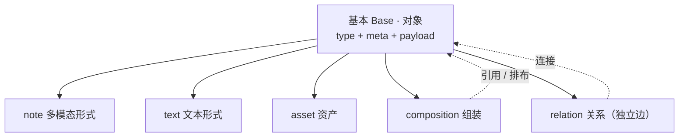
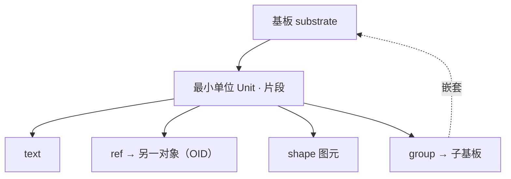
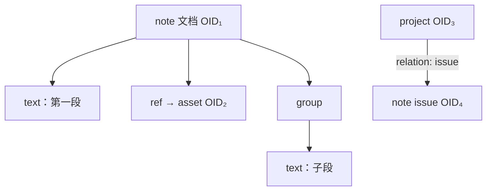

<!-- SPDX-FileCopyrightText: 2026 HanYang06 -->
<!-- SPDX-License-Identifier: Apache-2.0 -->

# 数据结构（对象模型 · 内存态 / 存储态）

> 定位：Cairn 的**对象模型总纲**——逻辑模型 + 存储态 + 内存态。
> 关系：[`storage.md`](./storage.md) 是 **L0 物理层的唯一事实来源**，本文引用它、不重复它；
> 语义与领域规则见 [`domains.md`](./domains.md)、[`note-model.md`](./note-model.md)。
> 一句话：**Cairn = 含义堆（meaning heap）**——底座只加能力、不改结构，语义往上堆。

状态：**草案 v0.1**（逻辑模型与判据已定；打包 / 表示升级 / 角色-格式 多为未实现）

---

## 0. 一页看懂（对象拓扑）

> 目的：让新协作者**不翻代码**就能建立整体图景。三张图 + 三种"边"。

### 0.1 对象种类（世界是什么）



### 0.2 基板内部（最小单位 / 片段）



### 0.3 一个实例（递归对象图）



### 0.4 只有三种"边"（上下左右）

| 方向 | 名称 | 含义 | 例 |
|---|---|---|---|
| **下** | 包含 containment | 对象 → 基板 → 片段；`group` → 子基板 | 文档含段落 |
| **横** | 引用 reference | 片段 → 另一个对象（OID），**不复制内容** | 文档嵌一张图 |
| **图** | 关系 relation | 对象 ⇄ 对象，独立、有向、带署名 | `derived-from` / issue |

> 记住这三条，就不会把"嵌入的图"和"关联的 issue"混成一回事。
> 三种边对应三种存储与生命周期：包含随父对象、引用靠 OID、关系是一等对象。

### 0.5 阅读路径

1. 本文：§2 词表与命名 → §4 逻辑模型 → §6 存储态 → §7 内存态。
2. 物理细节 → [`storage.md`](./storage.md)。
3. 领域语义 → [`domains.md`](./domains.md)、[`note-model.md`](./note-model.md)。
4. 代码入口 → 本文 §12 映射表。

---

## 1. 为什么单列一文

- Cairn 会**不停往上堆**（今天是笔记/项目，明天可能是别的东西）。**底层数据结构会持续扩张**，这是最大的风险。
- 不把结构**提前定死并写清楚**，将来重构会失控——所以本文的作用是**约束**：什么可以加、怎么加、什么绝不能动。
- 判据（任何设计变更都要过这三关，缺一不可）：

| 判据 | 含义 |
|---|---|
| **性能** | 读快、写快；加载与保存在最坏情况下也要可接受 |
| **存储利用率** | 不为结构本身浪费大量空间（"占 40G、有效 20G"不可接受） |
| **综合** | 并发性、安全性、可加密性、扩展性 |

---

## 2. 词表（先统一语言）

| 词 | 英文 | 含义 |
|---|---|---|
| 对象 / 节点 | Object / Node | 可寻址的最小单位＝一个 `Manifest` 承载的东西 |
| OID | — | **稳定**、作者绑定的对象标识（ULID）。**身份 ≠ 内容** |
| CID | — | **内容寻址**（keyed BLAKE3）。用于块与不可变叶的寻址/去重 |
| 基板 | Substrate | 片段的**序列**（可嵌套）。**全局基础数据格式** |
| 片段 | Fragment | 基板里的一个元素：文字 / 引用 / 图元 / 组合 |
| 语义段 | Segment | 有意义的片段边界（段、图元），**编辑与加载的粒度** |
| 存储块 | Chunk | FastCDC 切出的字节块，用于去重 / 加密 / 随机读 |
| 角色 | Role | 场景语义：`note` / `issue` / `pull` / `comment` / `doc`… |
| 格式 | Format | 编码形状：`substrate` / `asset` / `composition` |
| 组装 | Composition | 基板为"对其它节点的排布 / 引用"（文档 / 博客） |
| 关系 | Relation | 节点间的有向边（一等对象、带署名） |
| 文档头 | Head | 当前版本的 `Manifest` |

> **两个"块"别混**：`Segment`（语义，为编辑/加载）与 `Chunk`（物理，为去重/加密）。二者正交。

### 2.1 命名层级（提案，待确认）

| 名称 | 中文 | 含义 | 对应实现 |
|---|---|---|---|
| Base | **基本（对象）** | 一切皆对象的通用外壳 | `Object` / `Node`（`type + meta + payload`） |
| Unit | **最小单位** | 基板里最小可寻址单位（片段） | `fragment` / `segment` |
| Text | **文本形式** | 最小单位的纯文本形态 | `text` 片段 |
| Note | **多模态形式** | 最小单位的多模态形态（可装多类片段） | `cairn.note`（基板） |
| — | 子对象 | 基于"基本"派生/演变的各类对象 | 由 `type` 表达 |

> ⚠️ **基本（Base，对象外壳）** 与 **基板（Substrate，内容格式）** 两词极易混。
> 文档里一律写全「基本对象」「基板」，不单写。
>
> 一句话层级：**基本对象 → 其内容是基板 → 基板由最小单位（片段）组成 → 最小单位有文本形式(text)与多模态形式(note)。**

---

## 3. 分层

```
L3  领域（角色 + 规则）    note / project / asset / relation / composition
        │  只依赖 ↓ 的公共 API
L0.5 基板层（公共底座）     fragment 编解码 + 基板操作（本层是"基础数据格式"）
        │
L0  对象池（Qt-free）       对象/清单/块/加密/索引/版本
        │
物理层                      文件（见 storage.md）
```

**红线**：`L0 / L0.5` 不认识 `note / issue` 这些词；角色只活在 `L3`。

---

## 4. 逻辑对象模型

### 4.1 递归对象图

```
Node ── 基板(substrate) ── fragment[]
                                ├─ text   ……
                                ├─ ref     ──► 另一个 Node（OID）
                                ├─ shape   （矢量坐标）
                                └─ group   ──► 子基板（嵌套）
```

对象可以**包裹**对象，形成树/DAG。项目、文档、评论都落在这张图上。

**三种边（详见 §0.4）**：包含（向下，随父对象）、引用（横向，靠 OID）、关系（图边，一等对象）。三者存储与生命周期各不相同，混用是大忌。

### 4.2 基板是基础格式，`note` 只是角色

四要素（[`note-model.md`](./note-model.md) §2）里，**基础格式是"基板"，不是 note**。
issues、PR、讨论本质都是**文本流的基板**——它们不是"像 note"，而是"就是基板"，只是**角色**不同。

| 层 | 是什么 | 取值 |
|---|---|---|
| **format（全局）** | 怎么编码、怎么流转 | `substrate` / `asset` / `composition` |
| **type（领域语义）** | 这是什么东西 | `cairn.note` / `cairn.project.issue` / `cairn.project.pull` / `cairn.note.comment` |
| **role（场景显示）** | 在这个场景怎么称呼 | 笔记 / Issue / PR / 评论 |

**type → format 映射（一张表，禁止造第二套类型系统）：**

| type | format | 说明 |
|---|---|---|
| `cairn.note` | substrate | 笔记 |
| `cairn.project.issue` | substrate | 文本流 |
| `cairn.project.pull` | substrate | 文本流（+ 代码引用） |
| `cairn.note.comment` | substrate | 挂在别的节点下（用 Relation 连） |
| `cairn.composition` | composition | 基板为排布/引用 |
| `cairn.asset` | asset | 二进制/大对象 |

开发收益：**只写一个"基板编辑器"**，note / issue / PR / comment 复用它，UI 换壳即可。

### 4.3 扩展方式（"含义堆"怎么堆）

- 加**角色**：加一个 `type` + 映射表一行 + UI 壳。**不碰 Manifest**。
- 加**字段**：走 `meta.props`（见 [`domains.md`](./domains.md)）。**不碰 Manifest**。
- 加**关系**：加 `Relation.kind`。不碰底座。
- 只有**新的物理能力**（如新的加密原语）才动 L0，且必须过 §1 三判据。

---

## 5. 基板与片段

### 5.1 片段种类（当前 ↔ 目标）

| kind | 状态 | 说明 |
|---|---|---|
| `text` | 已实现 | 结构化文本片段，可内联 |
| `ref` / `embed` | 已实现 | 引用另一个 Node（OID），二进制外置 |
| `shape` | 草案 | 矢量图元（记录坐标，见 §5.4） |
| `group` | 草案 | 子基板（组合/嵌套），表示升级用 |

### 5.2 语义段 vs 存储块

| | 语义段 Segment | 存储块 Chunk |
|---|---|---|
| 单位 | 段落 / 图元 | 字节（FastCDC） |
| 边界 | 有意义、可寻址 | 内容定义、无意义 |
| 目的 | **改一段、载一段** | 去重 / 加密 / 随机读 |
| 现状 | 部分（fragment） | 已实现 |

### 5.3 溢出（spill）与表示升级

- **内联 vs 独立**：小片段**内联**在文档头里；超过阈值 `θ` 才升格为**独立叶**。
- **阈值 `θ` 的由来**：由"每对象固定开销"决定（见 §6.6）——太小＝对象爆炸，太大＝失去细粒度。初值取**几 KB 级**。
- **滞回**：涨到 `2θ` 才升格、掉到 `0.5θ` 才降格，避免边界抖动。
- **表示升级（"big note"）**：大文档的基板从**单叶**升为**基板树 / rope**（`group` 嵌套）。**对领域透明**——note / issue / PR 永远看到的都是"一个基板"。
  - `big note` 不是一种 `type`，而是**rope 的根**，是一层，不是新物种。

### 5.4 手绘 = 坐标（不是位图）

- `shape` 只存**识别后的标准图元矢量坐标**，不存笔迹、不存栅格图。
- 收益：体积小、可无限缩放、**天然内容寻址可去重**（相同的圆只存一份）。
- 难点在**识别/归一化质量**，不在存储。

---

## 6. 存储态

### 6.1 清单（Manifest，已实现）

`oid / space_id / type / mime / size / created / updated / chunks[] / meta / seq / prev / author / sig`。
正文载荷 = 基板编码（CBOR 片段序列）；`meta` 承载 `title / tags / props`。

### 6.2 身份 vs 地址（**关键分工，别混**）

| | OID（身份） | CID（地址） |
|---|---|---|
| 值 | 稳定、作者绑定（ULID） | 内容哈希（keyed BLAKE3） |
| 用于 | **谁**、版本链、可编辑对象 | **什么**、去重、不可变叶与块 |
| 变化 | 逻辑不变则不变 | 内容变则变 |

> **不要**试图用一个标识同时满足"稳定身份"和"内容去重"——两个目标互斥，分层解决。

### 6.3 版本链（已实现，语义已定）

- 只有**基板（内容）变化**才 `seq+1` 并归档；标题/标签/`props` 走 `put_meta`，**不产生历史**（`note-model.md` §4.1）。
- 保留窗默认 30 天，由 `vault.gc()` 裁剪。

### 6.4 叶与文档头（草案）

- **叶**：不可变、内容寻址的 segment（几 KB 级）。
- **文档头**：小而可变的 manifest，内容是**叶的引用表**。
- 编辑一段 = 写 1 个新叶 + 重写**很小的 head**；其余叶 CID 不变、不重写、不重存。
- 惰性：打开 = 读 head 引用表 → **只加载可视区**的叶。
- 这套＝git 的 `blob/tree` 一脉：版本自洽、去重、可懒加载。

### 6.5 物理布局（已实现 ↔ 草案）

| | 现状（已实现） | 目标（草案） |
|---|---|---|
| 对象 | 一对象一文件 | 逻辑对象 ↔ **追加式 pack** |
| 小块 | 各自成文件（4KB 块浪费） | **打包** + 索引 `(pack, offset, len)` |
| 更新 | 原子写新文件 | 追加 + 定期**压实** |
| 压缩 | 无 | **加密前压缩**（文本/图元收益大） |

### 6.6 利用率分析（为什么必须打包 + 阈值）

- 每对象固定开销 ≈ manifest(CBOR) + 签名(64B) + 公钥(32B) + nonce/tag(~28B) + 分帧 ≈ **400–800B**。
- FS 块 4KB：一个 200B 的对象实际占 **4KB** → 利用率 ~5%。
- 结论：**"每段一个文件对象"必炸**；必须（a）内联小片段 +（b）阈值溢出 +（c）物理打包。
- 散文靠**压缩 + 版本 GC**；去重红利主要在**图元/资产/重复模板**。

### 6.7 加密与完整性（部分已实现）

- 密钥：per-space（addr/data/meta 子密钥，已实现）。
- 加密：`seal`（ChaCha20-Poly1305），**随机 nonce**，安全。
- 去重：`cid = keyed_hash(addr_key, data)`（已实现）→ **空间内**去重，不跨空间泄漏明文相等性。
- 完整性：读时重算 CID 比对（已实现）→ 不吃"每对象签名"也够校验。
- 归属/防伪：**签名收口到文档头 / 检查点**（草案），小碎片不逐个签，省开销；现有每对象签名可保留在 L0 校验路径，但不作为小碎片的默认。

---

## 7. 内存态

### 7.1 运行时表示

```
Vault ── ObjectHandle(OID)          稳定身份，惰性
           └─ Head(Manifest)        当前版本（小块）
                └─ SubstrateHandle  引用表 + 已加载的叶
                       └─ Segment    未加载 = 代理（只知 OID/CID + 长度）
```

- **句柄（Handle）**：只持有 OID / 元信息，**不代表内容已在内存**。
- **叶代理（Proxy）**：未命中时为占位，命中后变实体。

### 7.2 加载与驱逐

- **按可视区加载**：编辑器只请求当前渲染需要的 segment（少量多次）。
- **缓存**：叶 LRU；文档头常驻。
- **驱逐**：非可视叶可丢弃（不可变 → 丢了再取，成本可控）。

### 7.3 编辑事务与并发

- 编辑一段：读叶 → 改 → 产新叶（新 CID）→ 更新 head 引用 → head `seq+1`。
- 叶**不可变** ⇒ 读端**无锁并发**；写端追加。
- 索引（SQLite）**单写**；同作者同对象的并发编辑靠版本链，多设备合并见 §9。

---

## 8. 版本与垃圾回收

- 版本以 **head 链**表达（已实现）；叶按引用计数/可达性回收（草案）。
- GC 目标：不可达叶、超窗版本、孤儿 pack 段（草案）。

---

## 9. 并发与一致性

| 场景 | 策略 | 状态 |
|---|---|---|
| 同进程读 | 不可变叶，无锁 | 目标 |
| 同进程写 | 追加 + 原子写 | 部分 |
| 索引 | SQLite（单写多读） | 已实现 |
| 同节点多作者 | 版本链 + 合并 | 预留 |
| 跨设备 | 不变叶 + CRDT/合并 | 预留（`note-model.md` §4.2 后置） |

---

## 10. 不变量（Invariants，谁都不许破）

1. **基板是唯一基础格式**；角色不改变编码。
2. **OID 稳定、CID 内容寻址**，二者不混用。
3. **一个 OID 的字节不可篡改**（内容寻址 + 校验 + 签名）。
4. **版本只记内容变化**；元数据不产生历史。
5. **小文档单叶、大文档树根**，表示升级对领域透明。
6. **加密前压缩**；去重**不跨空间**。
7. **不改 Manifest 字段**；扩展只走 `meta.props` / 新 `kind` / 新 `type`。
8. L0 / L0.5 **不认识领域语义词**。

---

## 11. 待定 / 预留

1. 溢出阈值 `θ` 的具体取值与滞回比例。
2. pack 的格式、索引方案与压实策略。
3. rope（表示升级）的具体结构（B-tree / RRB / 平衡树）。
4. 多设备/多作者的合并（CRDT vs 版本链合并）。
5. 叶级 GC 的引用计数方案。
6. 签名覆盖面的最终边界（头 / 检查点 / 每对象）。

---

## 12. 与代码映射

| 概念 | 代码 | 状态 |
|---|---|---|
| 对象 / 清单 | `core/storage/manifest.py`、`core/types/objects.py` | 已实现 |
| 存储块 / keyed CID | `core/storage/chunker.py`、`core/crypto.py` | 已实现 |
| 对象池 / 版本链 / put_meta | `core/vault.py` | 已实现 |
| 索引 | `core/storage/index.py` | 已实现 |
| 基板片段 | `domains/types/substrate.py` | 部分 |
| 角色（note） | `domains/note/__init__.py` | 部分（待降为角色） |
| 关系 / 组装 | `domains/relation.py`、`domains/composition.py` | 部分 |
| 打包 / 表示升级 / 角色-格式 / 惰性加载 | —— | **未实现** |
